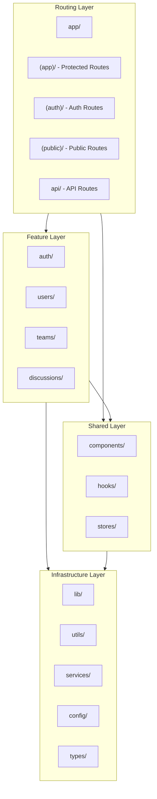

# Next.js 15/16 App Router — Project Structure

This document outlines a modern, production-ready **Next.js App Router** project structure following the latest conventions and best practices as of December 2025. The architecture maintains strict separation between **routing**, **reusable UI**, **domain features**, and **shared infrastructure**, leveraging React Server Components (RSC) and modern patterns.

---

## 🏗️ High-Level Architecture

### Core Principles

This architecture is built on Next.js 15/16 App Router fundamentals:

* **Server-First**: Leverages React Server Components (RSC) by default for optimal performance
* **Route Groups**: Organizes routes logically without affecting URL structure
* **Colocation**: Keeps related code close to where it's used
* **Feature-Based**: Groups related functionality into vertical slices
* **Type-Safe**: Full TypeScript coverage with strict typing

### Architectural Layers



### Layer Responsibilities

* **Routing Layer (`src/app`)**: 
  - Manages URL structures using file-system routing
  - Defines layouts, loading states, and error boundaries
  - Uses route groups `(groupName)` to organize without affecting URLs
  - Handles API routes and server actions
  - Primarily Server Components with strategic Client Components

* **Feature Layer (`src/features`)**: 
  - Vertical slices of business domains
  - Self-contained modules with own UI, logic, and API layer
  - Each feature includes: components, hooks, types, utils, and API logic
  - Promotes modularity and separation of concerns

* **Shared Layer (`src/components`, `src/hooks`, `src/stores`)**: 
  - Reusable UI components (design system primitives)
  - Custom React hooks for common functionality
  - Global state management (Zustand stores)
  - Cross-cutting concerns used throughout the app

* **Infrastructure Layer (`src/lib`, `src/config`, `src/utils`, `src/services`, `src/types`)**: 
  - Core services (API clients, auth, utilities)
  - Configuration and environment management
  - Pure utility functions
  - Shared business logic
  - TypeScript type definitions

---

## 📂 Detailed Directory Structure

```text
src/
├── app/                          # App Router (Next.js 15/16)
│   ├── (app)/                    # Protected routes group
│   │   ├── layout.tsx            # Authenticated layout with nav/sidebar
│   │   ├── loading.tsx           # Loading UI for entire section
│   │   ├── error.tsx             # Error boundary for protected routes
│   │   │
│   │   ├── dashboard/
│   │   │   ├── page.tsx          # Dashboard page (Server Component)
│   │   │   ├── loading.tsx       # Route-specific loading state
│   │   │   └── _components/      # Private, colocated components
│   │   │       ├── stats-card.tsx
│   │   │       └── activity-feed.tsx
│   │   │
│   │   ├── users/
│   │   │   ├── page.tsx          # Users list page
│   │   │   ├── [id]/             # Dynamic user detail route
│   │   │   │   ├── page.tsx
│   │   │   │   ├── loading.tsx
│   │   │   │   ├── error.tsx
│   │   │   │   └── _components/
│   │   │   │       └── user-profile.tsx
│   │   │   └── _components/
│   │   │       └── user-table.tsx
│   │   │
│   │   ├── settings/
│   │   │   ├── page.tsx
│   │   │   └── _components/
│   │   │       ├── profile-form.tsx
│   │   │       └── preferences.tsx
│   │   │
│   │   └── teams/
│   │       ├── page.tsx
│   │       └── [teamId]/
│   │           └── page.tsx
│   │
│   ├── (auth)/                   # Auth routes group
│   │   ├── layout.tsx            # Auth-specific layout (centered, no nav)
│   │   ├── login/
│   │   │   └── page.tsx          # Login page
│   │   ├── register/
│   │   │   └── page.tsx          # Registration page
│   │   ├── forgot-password/
│   │   │   └── page.tsx
│   │   ├── reset-password/
│   │   │   └── page.tsx
│   │   └── verify-email/
│   │       └── page.tsx
│   │
│   ├── (public)/                 # Public routes group
│   │   ├── layout.tsx            # Public layout with header/footer
│   │   ├── page.tsx              # Landing/home page
│   │   ├── about/
│   │   │   └── page.tsx
│   │   ├── pricing/
│   │   │   ├── page.tsx
│   │   │   └── _components/
│   │   │       └── pricing-card.tsx
│   │   ├── contact/
│   │   │   └── page.tsx
│   │   ├── blog/
│   │   │   ├── page.tsx
│   │   │   └── [slug]/
│   │   │       └── page.tsx
│   │   ├── terms/
│   │   │   └── page.tsx
│   │   ├── privacy/
│   │   │   └── page.tsx
│   │   ├── 404/
│   │   │   └── page.tsx
│   │   └── 500/
│   │       └── page.tsx
│   │
│   ├── api/                      # API routes (Route Handlers)
│   │   ├── auth/
│   │   │   ├── [...nextauth]/    # NextAuth.js catch-all route
│   │   │   │   └── route.ts
│   │   │   ├── signup/
│   │   │   │   └── route.ts
│   │   │   └── callback/
│   │   │       └── route.ts
│   │   ├── users/
│   │   │   ├── route.ts          # GET, POST /api/users
│   │   │   └── [id]/
│   │   │       └── route.ts      # GET, PATCH, DELETE /api/users/:id
│   │   ├── teams/
│   │   │   └── route.ts
│   │   ├── webhook/
│   │   │   └── route.ts
│   │   └── health/
│   │       └── route.ts          # Health check endpoint
│   │
│   ├── layout.tsx                # Root layout (required, wraps all routes)
│   ├── page.tsx                  # Root page (redirects or landing)
│   ├── not-found.tsx             # Global 404 page
│   ├── error.tsx                 # Root error boundary
│   ├── global-error.tsx          # Catches errors in root layout
│   ├── loading.tsx               # Global loading UI
│   └── template.tsx              # Alternative to layout (re-renders)
│
├── features/                     # Feature modules (vertical slices)
│   ├── auth/
│   │   ├── api/
│   │   │   ├── actions/          # Server Actions
│   │   │   │   ├── login.ts      # 'use server'
│   │   │   │   ├── register.ts
│   │   │   │   └── logout.ts
│   │   │   └── services/         # Business logic
│   │   │       ├── auth-service.ts
│   │   │       └── token-service.ts
│   │   ├── components/           # Feature-specific UI
│   │   │   ├── login-form.tsx
│   │   │   ├── register-form.tsx
│   │   │   ├── auth-provider.tsx
│   │   │   └── protected-route.tsx
│   │   ├── hooks/                # Feature-specific hooks
│   │   │   ├── useAuth.ts
│   │   │   ├── useSession.ts
│   │   │   └── useAuthPopup.ts
│   │   ├── types/                # Feature-specific types
│   │   │   └── auth.types.ts
│   │   ├── utils/                # Feature-specific utilities
│   │   │   ├── validation.ts
│   │   │   └── token.ts
│   │   └── index.ts              # Barrel export
│   │
│   ├── users/
│   │   ├── api/
│   │   │   ├── actions/
│   │   │   │   ├── update-profile.ts
│   │   │   │   └── delete-account.ts
│   │   │   └── services/
│   │   │       └── user-service.ts
│   │   ├── components/
│   │   │   ├── user-avatar.tsx
│   │   │   ├── user-card.tsx
│   │   │   └── user-list.tsx
│   │   ├── hooks/
│   │   │   └── useUser.ts
│   │   ├── types/
│   │   │   └── user.types.ts
│   │   └── index.ts
│   │
│   ├── teams/
│   │   ├── api/
│   │   ├── components/
│   │   ├── hooks/
│   │   ├── types/
│   │   └── index.ts
│   │
│   └── discussions/
│       ├── api/
│       ├── components/
│       ├── hooks/
│       ├── types/
│       └── index.ts
│
├── components/                   # Shared components
│   ├── ui/                       # Design system primitives (shadcn/ui)
│   │   ├── button.tsx
│   │   ├── input.tsx
│   │   ├── dialog.tsx
│   │   ├── dropdown-menu.tsx
│   │   ├── form.tsx
│   │   ├── card.tsx
│   │   ├── avatar.tsx
│   │   ├── badge.tsx
│   │   ├── tabs.tsx
│   │   ├── table.tsx
│   │   ├── select.tsx
│   │   ├── checkbox.tsx
│   │   ├── switch.tsx
│   │   ├── label.tsx
│   │   ├── separator.tsx
│   │   ├── skeleton.tsx
│   │   ├── popover.tsx
│   │   ├── sheet.tsx
│   │   ├── textarea.tsx
│   │   └── sonner.tsx
│   │
│   ├── layouts/                  # Layout components
│   │   ├── app-header.tsx
│   │   ├── app-footer.tsx
│   │   ├── sidebar.tsx
│   │   ├── nav-menu.tsx
│   │   └── breadcrumbs.tsx
│   │
│   ├── providers/                # App-level providers
│   │   ├── theme-provider.tsx    # Dark mode support
│   │   ├── query-provider.tsx    # React Query/TanStack Query
│   │   └── session-provider.tsx  # NextAuth session
│   │
│   ├── errors/                   # Error UI components
│   │   ├── error-boundary.tsx
│   │   ├── error-fallback.tsx
│   │   └── not-found-section.tsx
│   │
│   ├── theme-toggle.tsx          # Shared components at root
│   ├── user-menu.tsx
│   ├── search-bar.tsx
│   ├── logo.tsx
│   └── index.ts                  # Barrel export
│
├── hooks/                        # Shared custom hooks
│   ├── useMediaQuery.ts          # Responsive breakpoint detection
│   ├── useLocalStorage.ts        # LocalStorage with SSR support
│   ├── useDebounce.ts            # Debounce values
│   ├── useAsync.ts               # Async operation state
│   ├── useScrollThreshold.ts     # Scroll position detection
│   ├── useCopyToClipboard.ts     # Clipboard operations
│   ├── useOnClickOutside.ts      # Click outside detection
│   ├── useKeyPress.ts            # Keyboard event handling
│   └── index.ts                  # Barrel export
│
├── stores/                       # Zustand state stores
│   ├── useAuthStore.ts           # Auth state
│   ├── useUiStore.ts             # UI state (sidebar, modals)
│   ├── useThemeStore.ts          # Theme preferences
│   ├── useNotificationStore.ts   # In-app notifications
│   └── index.ts                  # Barrel export
│
├── lib/                          # Core services & utilities
│   ├── apiClient.ts              # Axios/Fetch API client setup
│   ├── auth.ts                   # NextAuth configuration
│   ├── http.ts                   # HTTP utilities
│   ├── db.ts                     # Database client (Prisma/Drizzle)
│   ├── email.ts                  # Email service (Resend, etc.)
│   ├── storage.ts                # File storage (S3, etc.)
│   ├── websocket.ts              # WebSocket client
│   └── index.ts                  # Barrel export
│
├── services/                     # Business logic layer
│   ├── user-service.ts           # User-related business logic
│   ├── auth-service.ts           # Auth business logic
│   ├── team-service.ts           # Team operations
│   ├── notification-service.ts   # Notification logic
│   └── index.ts                  # Barrel export
│
├── utils/                        # Pure utility functions
│   ├── cn.ts                     # Classname utilities (clsx + twMerge)
│   ├── formatters.ts             # Date, currency, number formatting
│   ├── validators.ts             # Validation helpers
│   ├── constants.ts              # App-wide constants
│   ├── errors.ts                 # Error handling utilities
│   ├── string.ts                 # String manipulation
│   ├── array.ts                  # Array utilities
│   └── index.ts                  # Barrel export
│
├── types/                        # TypeScript type definitions
│   ├── api.ts                    # API response/request types
│   ├── models.ts                 # Data model types
│   ├── enums.ts                  # Enums and constants
│   ├── global.d.ts               # Global type augmentations
│   ├── next-auth.d.ts            # NextAuth type extensions
│   └── index.ts                  # Barrel export
│
├── config/                       # Configuration
│   ├── env.ts                    # Environment variables (validated)
│   ├── paths.ts                  # Route path constants
│   ├── constants.ts              # App configuration constants
│   ├── navigation.ts             # Navigation menu config
│   ├── site.ts                   # Site metadata
│   └── index.ts                  # Barrel export
│
├── styles/                       # Global styles
│   ├── globals.css               # Tailwind directives + custom styles
│   └── themes.css                # Theme variables (optional)
│
├── middleware.ts                 # Route middleware (auth, i18n, etc.)
├── instrumentation.ts            # Server-side observability (Sentry, etc.)
└── instrumentation-client.ts     # Client-side instrumentation

public/                           # Static assets (served from root)
├── images/                       # Images
├── fonts/                        # Custom fonts
├── icons/                        # Icons, favicons
├── robots.txt                    # SEO crawling rules
└── sitemap.xml                   # Sitemap
```

---

## 🎯 Next.js Special Files Reference

Next.js uses special file naming conventions for routing and UI. These files are automatically recognized:

| File | Purpose | Required | Server/Client |
|------|---------|----------|---------------|
| `layout.tsx` | Shared UI that wraps child routes, persists across navigation | ✅ (root) | Server |
| `page.tsx` | Unique UI for a route, makes path publicly accessible | ✅ | Server |
| `loading.tsx` | Loading UI, automatically wraps page in Suspense boundary | ❌ | Server |
| `error.tsx` | Error UI boundary for route segment and its children | ❌ | **Client** |
| `global-error.tsx` | Global error UI, wraps entire application | ❌ | **Client** |
| `not-found.tsx` | 404 UI when `notFound()` is called | ❌ | Server |
| `route.ts` | API endpoint (Route Handler) | ❌ | Server |
| `template.tsx` | Similar to layout but re-renders on navigation | ❌ | Server |
| `default.tsx` | Fallback UI for Parallel Routes | ❌ | Server |

### File Conventions

* **Route Groups**: `(folderName)` - Organize routes without affecting URL path
* **Private Folders**: `_folderName` - Excluded from routing, used for colocation
* **Dynamic Routes**: `[param]` - Dynamic route segment
* **Catch-all Routes**: `[...param]` - Catch all route segments
* **Optional Catch-all**: `[[...param]]` - Optionally catch all segments
* **Parallel Routes**: `@folderName` - Simultaneously render multiple pages
* **Intercepting Routes**: `(..)folderName` - Intercept routes for modals

---

## 🎨 Best Practices

### 1. Naming Conventions

* **Directories**: Use `kebab-case` for route folders (e.g., `user-profile`, `settings`)
* **Components**: Use `PascalCase` for React components (e.g., `UserProfile.tsx`)
* **Utilities**: Use `camelCase` for functions and utilities (e.g., `formatDate.ts`)
* **Constants**: Use `SCREAMING_SNAKE_CASE` for constants (e.g., `MAX_FILE_SIZE`)
* **Types/Interfaces**: Use `PascalCase` (e.g., `interface UserProfile`)

### 2. Barrel Exports Pattern

Use `index.ts` files to create clean import paths:

```typescript
// hooks/index.ts
export { useMediaQuery } from './useMediaQuery'
export { useDebounce } from './useDebounce'
export { useLocalStorage } from './useLocalStorage'

// Usage in other files
import { useMediaQuery, useDebounce } from '@/hooks'
```

Benefits:
- Cleaner imports
- Easier refactoring
- Single source of truth
- Better IDE autocomplete

### 3. Component Colocation

Keep route-specific components close to where they're used:

```text
app/
└── dashboard/
    ├── page.tsx              # Uses components below
    └── _components/          # Private folder (not a route)
        ├── stats-card.tsx
        └── activity-feed.tsx
```

The `_` prefix excludes the folder from routing while keeping it colocated.

### 4. Server vs Client Components

**Default to Server Components** - only use Client Components when you need:
- Interactivity and event listeners (`onClick`, `onChange`, etc.)
- State (`useState`, `useReducer`, `useContext`)
- Effects (`useEffect`, `useLayoutEffect`)
- Browser-only APIs (localStorage, window, etc.)
- Custom hooks that depend on state/effects

```typescript
// Server Component (default)
export default async function UserPage({ params }: { params: { id: string } }) {
  const user = await fetchUser(params.id) // Direct DB/API calls
  return <UserProfile user={user} />
}

// Client Component (when needed)
'use client'
export function InteractiveButton() {
  const [count, setCount] = useState(0)
  return <button onClick={() => setCount(c => c + 1)}>{count}</button>
}
```

### 5. State Management Strategy

* **Server State**: Use React Server Components + Server Actions
* **Client State**: 
  - Local: `useState`, `useReducer`
  - Shared: Zustand stores (lightweight, no providers needed)
  - Form State: `react-hook-form` with Zod validation
* **URL State**: Use `searchParams` and `nuqs` for shareable state
* **Remote State**: TanStack Query for caching and synchronization

### 6. Type Safety

* Use TypeScript strict mode
* Define types in dedicated `types/` directories
* Use Zod for runtime validation
* Extend third-party types properly (e.g., `next-auth.d.ts`)
* Avoid `any` - use `unknown` when type is truly unknown

### 7. Error Handling

* Use error boundaries (`error.tsx`) at appropriate levels
* Implement global error handler (`global-error.tsx`)
* Use custom error classes for different error types
* Provide user-friendly error messages
* Log errors to monitoring service (Sentry, etc.)

### 8. Performance Optimization

* Use Server Components by default
* Implement proper loading states (`loading.tsx`)
* Use `Suspense` boundaries for streaming
* Optimize images with `next/image`
* Implement route prefetching
* Use dynamic imports for code splitting
* Minimize client-side JavaScript

---

## 🔧 Configuration Files

These files live at the project root and configure various aspects:

```text
root/
├── next.config.ts              # Next.js configuration
├── tailwind.config.ts          # Tailwind CSS configuration
├── postcss.config.mjs          # PostCSS configuration
├── tsconfig.json               # TypeScript configuration
├── .eslintrc.json              # ESLint rules
├── .prettierrc                 # Prettier formatting
├── .env.local                  # Local environment variables (gitignored)
├── .env.example                # Environment variable template
├── package.json                # Dependencies and scripts
├── components.json             # shadcn/ui configuration
└── middleware.ts               # Edge middleware (auth, redirects, i18n)
```

---

## 🚀 Modern Patterns

### Route Groups for Layout Organization

```text
app/
├── (marketing)/        # Landing, pricing, blog - marketing layout
│   ├── layout.tsx      # Marketing header/footer
│   ├── page.tsx
│   ├── pricing/
│   └── blog/
│
├── (app)/              # Dashboard, settings - app layout
│   ├── layout.tsx      # App sidebar/nav
│   ├── dashboard/
│   └── settings/
│
└── (auth)/             # Login, signup - minimal layout
    ├── layout.tsx      # Centered, no nav
    ├── login/
    └── signup/
```

### Server Actions in Features

```typescript
// features/auth/api/actions/login.ts
'use server'

import { z } from 'zod'

const loginSchema = z.object({
  email: z.string().email(),
  password: z.string().min(8),
})

export async function loginAction(formData: FormData) {
  const parsed = loginSchema.safeParse({
    email: formData.get('email'),
    password: formData.get('password'),
  })
  
  if (!parsed.success) {
    return { error: 'Invalid credentials' }
  }
  
  // Business logic here
  const result = await authenticateUser(parsed.data)
  return result
}
```

### Error Boundary Hierarchy

```text
app/
├── global-error.tsx         # Catches root layout errors
├── error.tsx                # Catches all route errors
└── dashboard/
    └── error.tsx            # Catches dashboard-specific errors
```

### Loading States Cascade

```text
app/
├── loading.tsx              # Global loading (rarely shown)
└── dashboard/
    ├── loading.tsx          # Dashboard loading
    └── users/
        └── loading.tsx      # Users list loading
```

---

## 📚 Additional Resources

* [Next.js Documentation](https://nextjs.org/docs)
* [App Router Best Practices](https://nextjs.org/docs/app/building-your-application)
* [React Server Components](https://react.dev/reference/rsc/server-components)
* [TypeScript Best Practices](https://www.typescriptlang.org/docs/handbook/declaration-files/do-s-and-don-ts.html)
* [shadcn/ui Components](https://ui.shadcn.com/)

---

**Last Updated**: December 2025 (Next.js 15/16)
